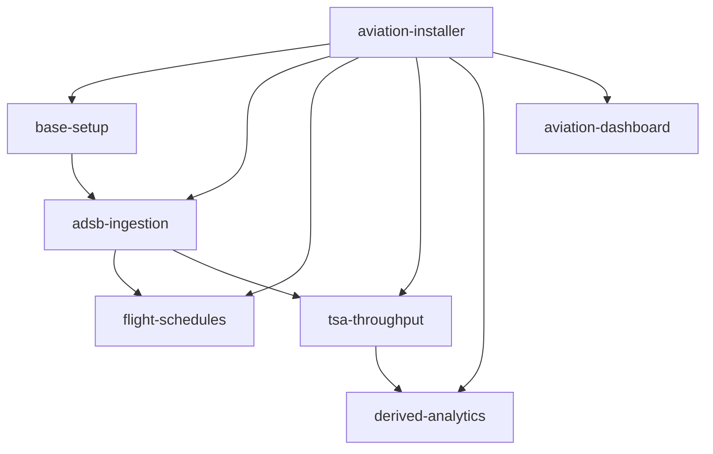

# AGENTS.md

Project-level guidance for AI coding assistants (Cortex Code, Cursor, Copilot, etc.) working in this repository.

## Repository Overview

Two independent installation approaches for per-airport analytics platforms on Snowflake:

| Approach | Entry Point | Dashboard | Audience |
|----------|-------------|-----------|----------|
| AI Agent (Skills) | `.cortex/skills/aviation-installer/` | `.cortex/skills/aviation-dashboard/` | Cortex Code users |
| Streamlit Installer | `standalone/installer/installer_daily.py` | `standalone/dashboard/` | Snowsight users |

Skills are fully self-contained under `.cortex/skills/` with zero runtime dependency on root-level directories. The `standalone/dashboard/` and `standalone/installer/` directories serve the Streamlit installer approach.

## Repository Structure

```
.cortex/skills/              # All Cortex Code skills (self-contained)
  ├── aviation-installer/    # Router skill + 5 sub-skills
  │   ├── SKILL.md           # Router: orchestrates installation phases
  │   ├── base-setup/        # Database, schemas, tags, airport properties, gates, runways
  │   │   └── data/          # Seed data (airlines.csv)
  │   ├── adsb-ingestion/    # ADS-B tables, EAIs, ingestion procedures, tasks, backfill
  │   ├── flight-schedules/  # Flight schedule tables, Aviationstack API ingestion
  │   ├── tsa-throughput/    # TSA checkpoint throughput, PDF extraction, AI_EXTRACT
  │   └── derived-analytics/ # 13 Dynamic Tables, monitoring views, KPI pipeline
  ├── aviation-dashboard/    # Dashboard deployment (Streamlit + React/SPCS)
  │   ├── dashboard-streamlit/  # Streamlit app source (pages, config, utils)
  │   └── dashboard-react/      # React 18 + deck.gl + Express (SPCS deployment)
  ├── aviation-cleanup/      # Tag-based object discovery and teardown
  ├── logs/                  # Skill execution error logs
  ├── evals/                 # Eval framework (trigger, quality, xref, sql)
  └── skill-optimiser/       # Skill audit tool (Anthropic best practices)
standalone/                  # Streamlit installer approach (legacy)
  ├── installer/             # Streamlit installer app + seed data
  └── dashboard/             # Streamlit dashboard app
logs/                        # Legacy error/friction logs
```

## Build, Test, and Lint

```bash
# Run skill evals (trigger accuracy, quality checks, cross-ref validation)
python3 .cortex/skills/evals/run_evals.py

# Audit a single skill interactively
# Invoke the skill-optimiser skill in Cortex Code: "audit skill <name>"
```

No global build/lint step — each skill is independently deployable via its own SKILL.md workflow.

## Skills Inventory

| Skill | Category | Purpose |
|-------|----------|---------|
| `aviation-installer` | infrastructure | Router: provisions airport databases via 5 sub-skills |
| `aviation-installer/base-setup` | infrastructure | Creates database, schemas, tags, airport/gate/runway properties, airline dimension |
| `aviation-installer/adsb-ingestion` | infrastructure | ADS-B tables, EAIs, ingestion procedures, tasks, backfill |
| `aviation-installer/flight-schedules` | infrastructure | Flight schedule tables, Aviationstack API ingestion |
| `aviation-installer/tsa-throughput` | infrastructure | TSA checkpoint throughput, PDF stages, AI_EXTRACT pipeline, weekly tasks |
| `aviation-installer/derived-analytics` | infrastructure | 13 Dynamic Tables, monitoring views, KPI pipeline |
| `aviation-dashboard` | infrastructure | Deploys dashboard (Streamlit-in-Snowflake or React/SPCS) |
| `aviation-cleanup` | developer-tools | Tag-based object discovery and teardown |
| `skill-optimiser` | developer-tools | Audits/optimizes skills per Anthropic best practices |

## Skill Conventions (Quick Reference)

For the full rule set, read `.cortex/skills/skill-optimiser/SKILL.md` and its `references/` directory. That skill encodes all conventions from "The Complete Guide to Building Skills for Claude" (Anthropic, Jan 2026).

Key rules:
- Folder name: **kebab-case**, must match `name` in YAML frontmatter
- Main file: exactly `SKILL.md` (case-sensitive). No `README.md` inside skill folders.
- Description: under **1024 chars**, formula: `[What] + [When] + [Triggers] + [Do NOT use for]`
- Body: under **5,000 words**. Move detailed content to `references/`
- No XML angle brackets in frontmatter. No "claude" or "anthropic" in skill names.
- Cross-skill references use full relative paths from repo root:
  ```
  > Read and follow `.cortex/skills/aviation-installer/base-setup/SKILL.md`
  ```
- Subskills nest as child folders; parent SKILL.md acts as a router
- All skills use `metadata.author: Snowflake SIT-IS` and `metadata.version: 1.0.0`
- Deployment skills must include `depends_on` in frontmatter listing prerequisite skills
- Deployment skills must include a `## Configuration` table with parameterized defaults
- Deployment skills must include a `## Required Privileges` table (no ACCOUNTADMIN assumptions)
- Deployment skills must include a `## Cleanup` section with DROP statements

## Error Logging

When any step fails or produces unexpected results (SQL errors, missing objects, wrong row counts, service failures, deployment issues), log the issue to `.cortex/skills/logs/` following the format in `.cortex/skills/logs/README.md`. Create one log file per execution: `<skill-name>_{YYYY-MM-DD}_{HH-MM}.md`. Continue execution where possible, logging all issues encountered. If execution completes with no issues, do not create an error log file.

## Friction Logging

**MANDATORY:** After every `aviation-installer` execution (regardless of success or failure), generate a friction log in `.cortex/skills/logs/`. This is NOT optional — every run produces a friction log, even if everything went smoothly.

File name: `friction-log_{YYYY-MM-DD}_{HH-MM}.md`

Follow the friction log template in `.cortex/skills/logs/README.md`. The log must capture:
- Exact wall-clock duration of each step
- Any friction points (confusing instructions, slow operations, unexpected behavior, race conditions, workarounds)
- **For each friction point:** what was done to resolve it during this run, and a recommendation for how to prevent it in future runs (e.g., skill wording change, new validation step, default change)
- A step-by-step status table showing OK/FAILED/SKIPPED for each workflow step
- Objects created counts, initial data row counts, and verification checklist
- Final summary with total execution time and overall outcome

If no friction was encountered, the log should still be created with "No friction points encountered." and the step timing table.

Sub-skills executed via `runSubagent` should report their friction points back to the parent, which consolidates them into the single friction log file.

## Creating a New Skill

1. Create folder: `.cortex/skills/my-new-skill/`
2. Create `SKILL.md` with YAML frontmatter + body (use `skill-optimiser` for the template)
3. Add `references/` for detailed SQL/code if body would exceed 5,000 words
4. Add `assets/` for notebooks or other deployable artifacts
5. Audit: invoke `skill-optimiser` or run `python3 .cortex/skills/evals/run_evals.py`
6. Update the Skills Inventory table above

## Do NOT

- **Inline large SQL blocks in SKILL.md** — put them in `references/*.md` and link
- **Skip the query tag** — every skill must set the session query tag for attribution tracking:
  ```sql
  ALTER SESSION SET query_tag = '{"origin":"sf_sit-is-aviation","name":"oss-<skill-name>","version":{"major":1,"minor":0},"attributes":{"is_quickstart":1,"source":"sql"}}';
  ```
- **Skip the object COMMENT** — every CREATE statement must include a COMMENT tracking tag (or `ALTER ... SET COMMENT` for CTAS):
  ```sql
  COMMENT = '{"origin":"sf_sit-is-aviation","name":"oss-<skill-name>","version":{"major":1,"minor":0},"attributes":{"is_quickstart":1,"source":"<sql|notebook|app>"}}';
  ```
- **Assume Overture Maps is installed** — always verify with `SHOW DATABASES LIKE 'OVERTURE_MAPS__BASE';` and auto-install if missing
- **Hardcode airport IATA/ICAO** — skills must be parameterized via `{IATA}`, `{ICAO}`, `{TARGET_DB}`, `{AIRPORT_ID}`
- **Add README.md inside skill folders** — all docs go in SKILL.md or `references/`
- **Duplicate conventions** — point to `skill-optimiser` references instead of repeating rules
- **Require ACCOUNTADMIN** — document minimum privileges in `## Required Privileges`; never assume ACCOUNTADMIN
- **Skip cleanup instructions** — every deployment skill must have a `## Cleanup` section with DROP statements
- **Create any Snowflake object or run any query without tracking tags** — this is a hard requirement with no exceptions. Every new Snowflake object (TABLE, VIEW, PROCEDURE, FUNCTION, STAGE, SCHEMA, DATABASE, WAREHOUSE, TASK, DYNAMIC TABLE, STREAMLIT, TAG, SECRET, FILE FORMAT) MUST have a COMMENT tracking tag. Every SQL session MUST set `query_tag` before executing statements. This applies to all skills, installer app, stored procedures, dynamic SQL inside procedure bodies, and any other code path that creates objects or runs queries. For objects created via CTAS or dynamic SQL, use `ALTER ... SET COMMENT` immediately after creation. For account-level objects that do not support COMMENT (EAIs, network rules), use consistent naming patterns (`{TARGET_DB}_PUBLIC_{SERVICE}_EAI`, `PUBLIC_{SERVICE}_RULE`) so `aviation-cleanup` can discover them.

## Tracking Tags

Two mechanisms — session `query_tag` (tracks queries) and object `COMMENT` (tracks created objects). Both are required. Origin = `sf_sit-is-aviation`.

### Session Query Tag
```sql
ALTER SESSION SET query_tag = '{"origin":"sf_sit-is-aviation","name":"oss-<skill-name>","version":{"major":1,"minor":0},"attributes":{"is_quickstart":1,"source":"sql"}}';
```

### Object COMMENT
```sql
COMMENT = '{"origin":"sf_sit-is-aviation","name":"oss-<skill-name>","version":{"major":1,"minor":0},"attributes":{"is_quickstart":1,"source":"<sql|notebook|app>"}}';
```

### Tracking Names by Skill

| Skill | Tracking Name |
|-------|--------------|
| aviation-installer | `oss-aviation-installer` |
| base-setup | `oss-aviation-base-setup` |
| adsb-ingestion | `oss-aviation-adsb-ingestion` |
| flight-schedules | `oss-aviation-flight-schedules` |
| tsa-throughput | `oss-aviation-tsa-throughput` |
| derived-analytics | `oss-aviation-derived-analytics` |
| aviation-dashboard | `oss-aviation-dashboard` |
| aviation-cleanup | `oss-aviation-cleanup` |

## Skill Dependency Graph



**Deploy order:** top to bottom (base-setup first, dashboard last).
**Teardown order:** bottom to top (dashboard first, database last). Use `aviation-cleanup` for automated teardown.

## Common Patterns

- **Overture Maps dependency**: base-setup extracts airport geometry, gates, runways from `OVERTURE_MAPS__BASE`. Auto-install if missing via `CALL SYSTEM$ACCEPT_LEGAL_TERMS` + `CREATE DATABASE FROM LISTING`.
- **Per-airport database**: every airport gets `AIRPORT_{IATA}` database with `PUBLIC` and `TAGS` schemas.
- **Dedicated warehouse**: each airport gets `AVIA_{IATA}_WH` (XSMALL, auto-suspend 60s).
- **Dynamic Table pipeline**: 13 DTs cascade from `ADSB_DATA_LOCAL` through gate analysis, traffic analysis, runway crossings, and KPI views.
- **Task DAG ordering**: resume in leaf-to-root order (avoids "Unable to update graph" errors); suspend in root-to-leaf order.
- **External Access Integrations**: account-level objects for adsb.lol, GitHub, Aviationstack, TSA.gov, PyPI. Named `{TARGET_DB}_PUBLIC_{SERVICE}_EAI`. Cannot carry COMMENT — matched by name pattern during cleanup.
- **Dashboard multi-airport**: Streamlit app lives inside the airport database and auto-discovers all `AIRPORT_XXX` databases via `SHOW DATABASES LIKE 'AIRPORT_%'`.
- **Git Repository Stage**: source files deployed from `@{TARGET_DB}.{SCHEMA}.AVIA_OPS_REPO/branches/main` (inside each airport database).

## Dashboard Conventions (Skills Approach)

- Streamlit source: `.cortex/skills/aviation-dashboard/dashboard-streamlit/`
- React source: `.cortex/skills/aviation-dashboard/dashboard-react/`
- Streamlit entry point: `streamlit_app.py`
- Pages use Streamlit multipage pattern: `pages/`
- Config modules: `config/` (core.py, colors.py, ui.py)
- Shared utilities: `utils.py` and `ui_components.py`
- Streamlit deployed via Git Repository Stage:
  ```sql
  CREATE OR REPLACE STREAMLIT {DB}.{SCHEMA}.{APP_NAME}
    ROOT_LOCATION = '@{DB}.{SCHEMA}.AVIA_OPS_REPO/branches/main/.cortex/skills/aviation-dashboard/dashboard-streamlit'
    MAIN_FILE = 'streamlit_app.py'
    QUERY_WAREHOUSE = {WAREHOUSE};
  ```
- React deployed via SPCS (see `dashboard-react/Dockerfile.runtime` and `aviation_dashboard_service.yaml`)

## Streamlit Installer (Legacy Approach)

- Source in `standalone/installer/` directory
- Dashboard source in `standalone/dashboard/` directory
- `installer_daily.py` — Streamlit-in-Snowflake app that generates and executes installation SQL
- Deployed from Git Repository Stage: `@{TARGET_DB}.{SCHEMA}.AVIA_OPS_REPO/branches/main/standalone/installer`
- Seed data: `standalone/installer/airlines.csv` (loaded into `HELPER_AIRLINE_DIM` during base-setup)
- Secrets handling: masks `SECRET_STRING` literals in UI display while executing real SQL
- Dashboard deployed via: `ROOT_LOCATION = '@.../standalone/dashboard'`

## Airport Database Schema

Every `AIRPORT_{IATA}` database follows this object layout:

### Schemas
- `PUBLIC` — all operational tables, views, DTs, procedures, tasks
- `TAGS` — cost-attribution tags (SOLUTION, COMPONENT)

### Key Tables
| Table | Created By | Purpose |
|-------|-----------|---------|
| `PROPERTIES_AIRPORT` | base-setup | 1 row: airport metadata and geometry |
| `PROPERTIES_GATES` | base-setup | Gate reference points from Overture |
| `PROPERTIES_RUNWAYS` | base-setup | Runway polygons from Overture |
| `PROPERTIES_INFRASTRUCTURE` | base-setup | Full airport infrastructure geometry |
| `HELPER_AIRLINE_DIM` | base-setup | Airline IATA code to name lookup |
| `ADSB_DATA` | adsb-ingestion | Raw ADS-B telemetry (append-only) |
| `FLIGHT_SCHEDULE` | flight-schedules | Flight schedule records from Aviationstack |
| `TSA_THROUGHPUT` | tsa-throughput | TSA checkpoint passenger throughput data |

### Key Dynamic Tables (13 total)
| Dynamic Table | Created By | Purpose |
|--------------|-----------|---------|
| `ADSB_DATA_LOCAL` | derived-analytics | Filtered ADS-B within airport bounding box |
| `GATE_ANALYSIS_AIRCRAFT_GROUND_SESSIONS` | derived-analytics | Ground movement sessions |
| `GATE_ANALYSIS_ADSB_GROUND_POINTS` | derived-analytics | Ground-level ADS-B points |
| `GATE_ANALYSIS_FLIGHT_GATE_TIME` | derived-analytics | Per-flight gate dwell times |
| `GATE_ANALYSIS_GATE_UTIL_DAILY` | derived-analytics | Daily gate utilization metrics |
| `GATE_ANALYSIS_GATE_AIRLINE_DWELL_DAILY` | derived-analytics | Airline-level gate dwell |
| `GATE_ANALYSIS_FLIGHT_DWELL_WITH_AIRLINE` | derived-analytics | Flight dwell with airline names |
| `RUNWAY_CROSSINGS_DETAILED` | derived-analytics | Aircraft runway crossing events |
| `FLIGHT_TRAFFIC_FACT_ADSB_DAILY` | derived-analytics | Daily traffic aggregates |
| `FLIGHT_TRAFFIC_FACT_ADSB_HOURLY` | derived-analytics | Hourly traffic patterns |
| `FLIGHT_TRAFFIC_FACT_AIRLINE_TRAFFIC_DAILY` | derived-analytics | Per-airline daily traffic |
| `FLIGHT_TRAFFIC_FACT_AIRLINE_DELAY_DAILY` | derived-analytics | Per-airline delay metrics |
| `FLIGHT_TRACKER_FLIGHT_LIST` | derived-analytics | Flight list for tracker dropdown |

### Key Views
| View | Purpose |
|------|---------|
| `V_AIR_OPS_DAILY_KPIS` | Aggregated daily operational KPIs |
| `HELPER_MONITOR_LAST_REFRESH` | DT refresh timestamps and row counts |
| `HELPER_QA_COUNTS_DAILY` | Daily row count quality checks |

### Task DAG
```
TASK_INGEST_ADSB (root, 5-min schedule)
├── TASK_ENRICH_ADSB
├── TASK_ENRICH_AIRCRAFT_META
├── TASK_REFRESH_DERIVED
│   └── TASK_REFRESH_ANALYTICS
├── TASK_FLIGHT_SCHEDULE (optional, if API key provided)
└── TASK_FETCH_TSA_PDF (optional, weekly Monday 9am PT)
    └── TASK_EXTRACT_TSA_PDF
```
