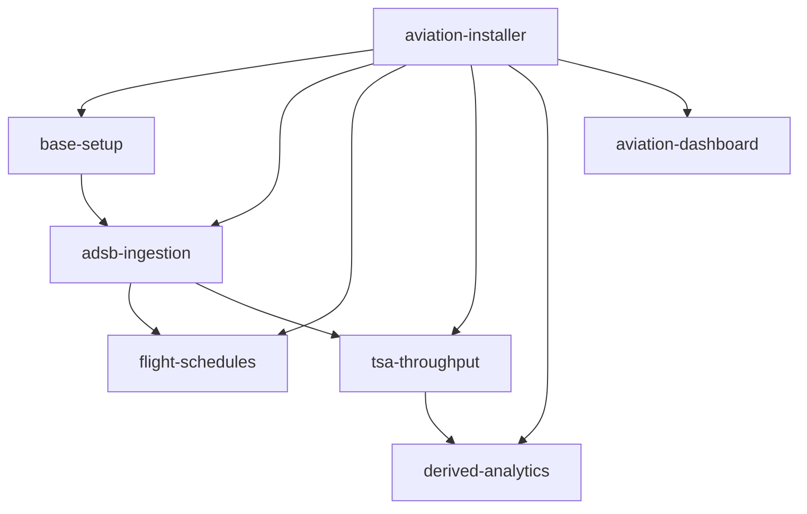

# Aviation Operations Intelligence on Snowflake

A Snowflake-native aviation analytics platform using ADS-B flight tracking, flight schedules, TSA checkpoint throughput, and airport infrastructure from Overture Maps. Deploy per-airport analytics with automated pipelines, 13 Dynamic Tables, and interactive dashboards.

Deploy and extend the solution using [Cortex Code](https://docs.snowflake.com/en/user-guide/cortex-code) skills. Each skill is a self-contained playbook the AI agent follows step by step.

## Prerequisites

- [Cortex Code](https://docs.snowflake.com/en/user-guide/cortex-code) with an active Snowflake connection
- Snowflake account with privileges to create databases, warehouses, external access integrations, and tasks
- [Overture Maps - Base](https://app.snowflake.com/marketplace/listing/GZT0Z4CM1E9KV/carto-overture-maps-base) listing (free, from Snowflake Marketplace)
- Aviationstack API key (optional, required for flight schedule ingestion)

**Estimated deployment time:** 15 to 60 minutes depending on airport size and backfill options.

## Quick start

1. Open this repository in Cortex Code
2. Say **"install airport SAN"** to deploy San Diego International Airport
3. Say **"deploy aviation dashboard"** to launch the interactive dashboard
4. Say **"aviation-cleanup"** when you are done to tear everything down

## What you get

### Per-airport database

Every airport gets its own `AIRPORT_{IATA}` database with automated pipelines, analytics tables, and monitoring views.

| Object | Description |
|--------|-------------|
| `ADSB_DATA` | Raw ADS-B flight telemetry (append-only, 5-min ingestion) |
| `FLIGHT_SCHEDULE` | Flight schedule records from Aviationstack API |
| `TSA_THROUGHPUT` | TSA checkpoint passenger throughput (weekly PDF extraction) |
| `PROPERTIES_AIRPORT` | Airport metadata and geometry from Overture Maps |
| `PROPERTIES_GATES` | Gate reference points |
| `PROPERTIES_RUNWAYS` | Runway polygons |
| `HELPER_AIRLINE_DIM` | Airline IATA/ICAO code to name lookup |

### Data pipelines

Automated task DAG runs continuously:

| Task | Schedule | Purpose |
|------|----------|---------|
| `TASK_INGEST_ADSB` | Every 5 minutes | Pulls ADS-B data from adsb.lol API |
| `TASK_ENRICH_ADSB` | After ingestion | Enriches with flight schedule data |
| `TASK_ENRICH_AIRCRAFT_META` | After ingestion | Adds aircraft metadata from GitHub |
| `TASK_FLIGHT_SCHEDULE` | After ingestion | Fetches schedules from Aviationstack |
| `TASK_FETCH_TSA_PDF` | Weekly (Monday 9am PT) | Downloads TSA throughput PDF |
| `TASK_EXTRACT_TSA_PDF` | After PDF fetch | Extracts data using AI_EXTRACT |

### Dynamic Table analytics (13 tables)

A cascade of Dynamic Tables transforms raw data into analytics-ready datasets:

| Category | Dynamic Tables | What they compute |
|----------|---------------|-------------------|
| **Gate Analysis** | 6 DTs | Ground sessions, gate proximity, dwell times, daily gate utilization, airline-level dwell |
| **Traffic Analysis** | 4 DTs | Daily and hourly traffic volumes, per-airline traffic and delay metrics |
| **Runway Safety** | 1 DT | Aircraft runway crossing events during taxi operations |
| **Flight Tracking** | 1 DT | Filtered local ADS-B data within airport bounding box |
| **Flight List** | 1 DT | Flight list for tracker dropdown |

### Dashboard pages

| Page | What it shows |
|------|--------------|
| **Live View** | Real-time and historical aircraft positions on interactive map |
| **Flight Tracker** | Individual flight path replay with altitude and speed |
| **Ground Activity** | Aircraft movements, taxi patterns, ground operations |
| **Runway Crossings** | Safety analysis of aircraft crossing active runways |
| **Traffic Analysis** | Flight volume trends, peak times, airline breakdowns |
| **Gate Analysis** | Gate utilization, occupancy rates, dwell time analytics |
| **TSA Throughput** | Checkpoint passenger volumes with geospatial map |
| **Monitoring** | System health, data freshness, pipeline status |
| **Performance** | Query performance and optimization metrics |

## Data sources

| Source | Data | Access |
|--------|------|--------|
| [adsb.lol](https://api.adsb.lol/) | ADS-B flight telemetry | Free API, no key required |
| [Aviationstack](https://aviationstack.com) | Flight schedules (arrivals/departures) | API key required (paid tier recommended) |
| [Overture Maps](https://overturemaps.org/) | Airport infrastructure (runways, gates, terminals) | Free Snowflake Marketplace listing |
| [TSA.gov](https://www.tsa.gov) | Checkpoint passenger throughput PDFs | Free, public data |
| [GitHub](https://github.com) | Aircraft metadata (type, registration) | Free, public data |

## How to use

### Invoking skills (Cortex Code)

Open this repo in Cortex Code and type any of these phrases:

| What you want | What to say |
|---------------|-------------|
| Deploy an airport | `install airport SAN` |
| Deploy the dashboard | `deploy aviation dashboard` |
| Clean up everything | `aviation-cleanup` |

The installer skill walks through 5 phases automatically: base setup, ADS-B ingestion, flight schedules, TSA throughput, and derived analytics.

### Streamlit installer (legacy)

A standalone Streamlit-in-Snowflake installer is available in `standalone/installer/`. Deploy it via Git Repository Stage:

```sql
CREATE OR REPLACE DATABASE AIRPORT_{IATA};
USE DATABASE AIRPORT_{IATA};
USE SCHEMA PUBLIC;

CREATE OR REPLACE API INTEGRATION github_api_integration
  API_PROVIDER = git_https_api
  API_ALLOWED_PREFIXES = ('https://github.com/Snowflake-Labs/')
  ENABLED = TRUE;

CREATE OR REPLACE GIT REPOSITORY AIRPORT_{IATA}.PUBLIC.AVIA_OPS_REPO
  API_INTEGRATION = github_api_integration
  ORIGIN = 'https://github.com/Snowflake-Labs/sfguide-aviation-ops-intelligence/';

ALTER GIT REPOSITORY AIRPORT_{IATA}.PUBLIC.AVIA_OPS_REPO FETCH;

CREATE OR REPLACE STREAMLIT AIRPORT_{IATA}.PUBLIC.AIRPORT_ANALYTICS_DASHBOARD
  ROOT_LOCATION = '@AIRPORT_{IATA}.PUBLIC.AVIA_OPS_REPO/branches/main/standalone/dashboard'
  MAIN_FILE = 'streamlit_app.py'
  QUERY_WAREHOUSE = MY_WH
  TITLE = 'Airport Analytics Dashboard';
```

### Multi-airport support

The solution supports deploying separate analytics instances for different airports. Each airport gets its own database (`AIRPORT_SAN`, `AIRPORT_LAX`, etc.) and dedicated warehouse. The dashboard auto-discovers all `AIRPORT_*` databases via `SHOW DATABASES LIKE 'AIRPORT_%'`.

### Cleanup

Say **"aviation-cleanup"** in Cortex Code to discover and remove all Snowflake objects created by the solution. The cleanup skill uses JSON COMMENT tags to find objects and generates DROP statements in reverse-dependency order.

---

## For developers

### Repository structure

```
.cortex/skills/              # All Cortex Code skills (self-contained)
  ├── aviation-installer/    # Router skill + 5 sub-skills
  │   ├── base-setup/        # Database, schemas, tags, airport properties
  │   ├── adsb-ingestion/    # ADS-B tables, EAIs, ingestion procedures, tasks
  │   ├── flight-schedules/  # Flight schedule tables, Aviationstack API
  │   ├── tsa-throughput/    # TSA checkpoint throughput, PDF extraction
  │   └── derived-analytics/ # 13 Dynamic Tables, monitoring views, KPIs
  ├── aviation-dashboard/    # Dashboard deployment (Streamlit + React/SPCS)
  ├── aviation-cleanup/      # Tag-based object discovery and teardown
  ├── skill-optimiser/       # Skill audit tool
  └── evals/                 # Eval framework (trigger, quality, cross-ref)
standalone/                  # Streamlit installer approach (legacy)
  ├── installer/             # Streamlit installer app + seed data
  └── dashboard/             # Streamlit dashboard app
AGENTS.md                    # AI assistant project guidance
```

### Skills inventory

| Skill | Purpose |
|-------|---------|
| `aviation-installer` | Router: provisions airport databases via 5 sub-skills |
| `aviation-installer/base-setup` | Database, schemas, tags, airport properties, gates, runways, airline dimension |
| `aviation-installer/adsb-ingestion` | ADS-B tables, external access integrations, ingestion procedures, tasks, backfill |
| `aviation-installer/flight-schedules` | Flight schedule tables, Aviationstack API ingestion |
| `aviation-installer/tsa-throughput` | TSA checkpoint throughput, PDF stages, AI_EXTRACT pipeline |
| `aviation-installer/derived-analytics` | 13 Dynamic Tables, monitoring views, KPI pipeline |
| `aviation-dashboard` | Deploys dashboard (Streamlit-in-Snowflake or React/SPCS) |
| `aviation-cleanup` | Tag-based object discovery and teardown |
| `skill-optimiser` | Audits and optimizes skills per Anthropic best practices |

### Dependency graph



Deploy order: top to bottom (base-setup first, dashboard last). Teardown order: bottom to top.

For skill conventions and developer rules, see [AGENTS.md](AGENTS.md).

## License

Apache License 2.0
